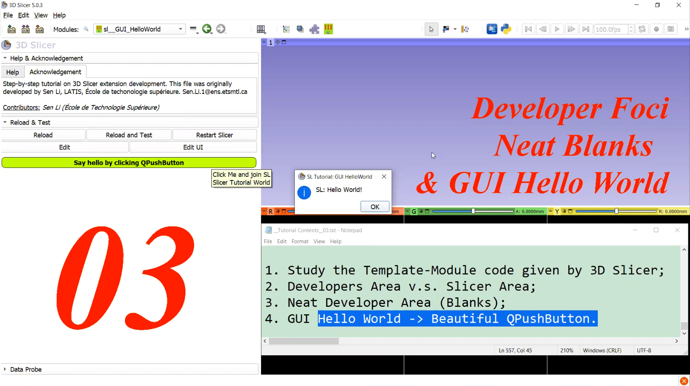

# <a href="https://github.com/SenonETS/3DSlicerTutorial_ExtensionModuleDevelopment/" style="text-decoration:none">3D Slicer Extension Tutorial: Step by Step</a>

## <a href="./" style="text-decoration:none">Step 03: Developer Foci, Neat Blanks & GUI Hello World</a>

