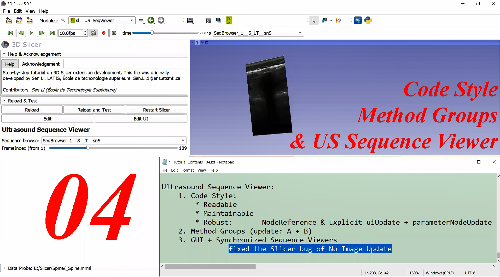

# <a href="https://github.com/SenonETS/3DSlicerTutorial_ExtensionModuleDevelopment/" style="text-decoration:none">3D Slicer Extension Tutorial: Step by Step</a>

 
 

## <a href="./" style="text-decoration:none">Step 04: Index SequenceBrowser</a>

#### <a href="https://www.youtube.com/watch?v=f_gsm0GJ4_8&list=PLTuWbByD80TORd1R-J7j7nVQ9fot3C2fK">YouTube Video Tutorial for Step_04</a>

#### <a href="https://www.bilibili.com/video/BV1KA411f71N/" >Bilibili Video Tutorial for Step_04</a>

